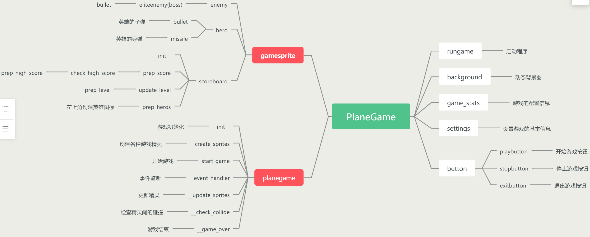

## 实验环境
- 操作系统：windows10
- python 版本：python3.7.6及其以上
- 主要用到的包：pygame1.9.6，random，time，sys

## 程序结构

## 功能模块

###  主要功能：

1. 英雄飞船可以上下左右自由移动，但不能超出游戏窗口边界。
2. 英雄不仅可以发射子弹，还可以发射导弹，导弹一次可以减少boss两滴血
3. 敌机游戏窗口的随机位置产生，并且可以随机向左或向右移动，并且不会相互碰撞
4. 当英雄到达5级后，出现boss，boss敌机一共有五滴血，并可以发射子弹，也能随机地向左或者向右移动
5. 实现了动态背景图
6. 在英雄升级的时候，会产生无敌果实，可以让英雄飞机无敌三秒钟

### 主要模块：

#### gamesprite:

​	继承自 <code>pygame.sprite.Sprite</code>，是游戏中精灵的基类，**enemy**、**hero**、**bullet**、**missile**、**button**这些类都继承自 gamesprite。gamesprite中有两个方法：<code>\__init__(self, image_name, speed=1)</code> ，<code>update(self)</code>

​	<code>\__init__()</code>: 对精灵的初始化，设置其图片，设置默认速度为 1 ，并获得其图片矩阵。

​	<code>update()</code>: 更新精灵的位置，但是只能是在 y 轴上下移动，如果要实现左右移动，可以在其子类中添加

#### planegame:

​	是一个游戏类，创建一个 planegame 对象，调用其 start_game() 方法启动游戏。这个类包含多种方法：

* <code>\__init__()</code>: 初始化游戏，设置游戏的基本信息，比如窗口大小，创建 settings，game_stats 对象、游戏时钟、设置定时器事件。
* <code>\_create_sprites()</code>: 创建游戏精灵和精灵组。比如：创建敌机，并将敌机添加到敌机精灵组中
* <code>start_game()</code>: 一个无限循环，通过调用类中的各种方法实现屏幕刷新。
* <code>\__event_handler()</code>: 事件检测。对用户执行的各种操作（按键盘，点击鼠标）做出响应。
* <code>\__update_sprites()</code>: 更新精灵组中的全部精灵的状态（精灵的位置，英雄的状态，boss的血量等等）
* <code>\__check_collide()</code>: 检测精灵间的碰撞。
* <code>\__game_over()</code>：结束游戏，关闭pygame资源

#### button:

​	继承自 gamesprite, 当点击Play按钮时，重新设置游戏基本信息并开始游戏。点击 Stop 按钮时，停止游戏。点击 Exit 按钮时，结束游戏。

#### hero:

​	英雄类，可以上下左右移动，能够发射子弹和导弹，子弹只能减少敌人一滴血，导弹可以减少敌人两滴血。当英雄碰撞无敌果实后可以保持无敌状态三秒。

#### Enemy:

​	普通敌机，在游戏窗口中随机产生，并能在互不碰撞的情况下随机向左向右移动。

#### EliteEnemy:

​	继承自 Enemy，是boss敌机，有无滴血，可以发射子弹，随机左右移动。

## 算法说明
​	使用 bfs 算法检测外星人是否会相互碰撞

## 使用说明
​	将压缩包解压缩后，进入PlaneGame文件夹，在该文件夹中启动Windows命令处理器（在Windows操作系统下：window键+r），然后输入 <code>python rungame.py</code>即可启动游戏，点击窗口的 Play 按钮 即可开始游戏。

